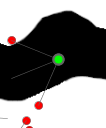
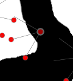
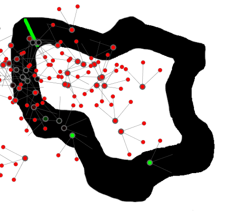
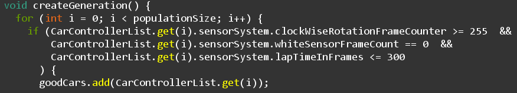
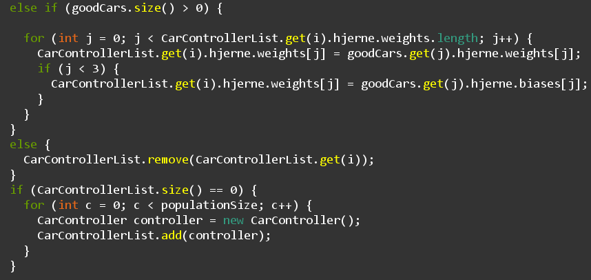
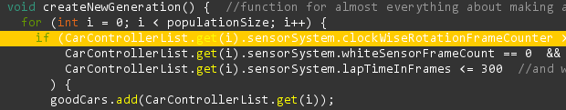
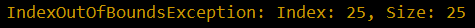

# Racecar-Evolution
The goal for this assignment is to utilize a neural network along with a genetic algorithm
to have a population of racecars evolve and choose better and better routes around a racetrack.

These racecars move around, depending on signals from their sensors - located in front of each racecar.

The sensors detect the color of the background and the racecars turn accordingly - that's how they know which way to go.

### Upon running the program / initial generation
When the program is started, the population of racecars is created in a specified spot. They then start to move with their constant speed, and in the direction their sensors tell them to turn.

While a car is inside the bounds of the race track, it's body will remain black. If it starts going counter clockwise around the track, then it becomes progressively more green, until it is fully green. These racecars have done well, which is what the green indicates:  

If, however, the racecar goes outside the track, the body sensor starts becoming red. This indicates a bad racecar, which is useful for figuring out which cars should not be chosen for the next generation:  

## The desired result
The end goal was, of course, to have a population of cars that all drove around the race track in an optimal manner, where they would all take the most effective turns and thereby reach the finish line as fast as possible. In the first generation there were usually 1 or 2 cars would drive around the track well enough to turn completely green, while all the others would either freak out and drive around in circles, or drive right off the track - usually also while spinning out of control. But having just one or two good cars would be enough because it would be a way to obtain some weights and biases, that work well for the track.  
  
After a set amount of frames, within which it would be possible for a semi-slow/bad car to reach the finish line, all the bad cars would be removed. The amount of removed cars would then be added back to the arraylist of cars, and all these new cars would then be given the same weights/biases, as the fastest car from before (the previous generation). Here the weights and values would be mutated a bit, in order to introduce and keep more variation in the cars and their behaviours, thereby allowing for the possibility of an even faster car to emerge in a following generation.  
This process would then be repeated, until all the cars were driving close to optimally (remember; mutation would also worsen some cars, thereby keeping all cars from being optimal).

### What actually happened
The group wanted a function, that could find the weights/biases of the best cars and therefore made a function for it. It ended up working as inteded and started printing the weights/biases of all the good cars that were found in the consol. Afterwards they desided to utilize the part of the function, that found the good cars, to then weed out the bad cars, since the bad cars were being found anyway. Below is the if-statement that checked, if a car was good or not.  

However, due to the bad cars being removed, even though new cars were being added in in the very same frame, just a couple lines after removal, the group experienced problems with indexes going out-of-bounds. A group member had the idea of, instead of removing bad cars, only to add in new cars, that would be given the good weights and biases of the good cars, the bad cars wouldn't be removed, but *they* would be given the good weights/biases. It would thereby not be necessary to remove any cars at all.  
Though this seemed like a good plan at first, a new problem arose with the way good cars were chosen; if a good car was found, then the car would be added to another arraylist called "goodCars" in order to save it (and along with it; it's weights and biases). When a bad car was found, then it would be given the good weights and biases, using a good car from the goodCars-arraylist.  
The problem is, though, that if a good car wasn't found as the first car, the program looked at, then no good cars would exist in the arralyst, and non-existant weights/biases would be attempted to be given to a bad car. This is what *was believed* to be the issue, though it was never actually tested to confirm it, due to this being a core part of the function. Therefore a few if/else-statements were used, to try solving this possible cause of the issue;  
Firstly, if a good car was not found, the function would check if there had been found any other good cars, by checking if the goodCars-arraylist's size was above 0. If so, the weights/biases would be added to the bad car found. if not, then the bad car in question, would be removed. A final if-statement was used to check, if there were no more cars left (i.e. all cars had been doing poorly, and so were all removed). If so, then there would be added as many new cars, as the population was set to, in order to create a brand new population. Below is the code for this attempted fix:  

This did not work either, however. Instead a completely new and unexpected IndexOutOfBoundsException was given. This time for the if-statement, that checked if a car was good or not:  
  
  
Through a bit of testing and help from others, it was determined that the exception was equal to half of the population; with a population of 100, 50 would be out of bounds, even though the for-loop, in which the if-statement was situated, kept going as long as a temporary variable for the index was smaller than the size of the population. This meant that the CarControllerList-arraylist was changing while the for-loop was running, resulting in this new out-of-bounds exception.

## The end result
In the end, the desired result was not reached at all. The group couldn't figure out the problem and were, quite frankly, completely lost as to the reason for the sudden error. The desired end goal was therefore not reached.
